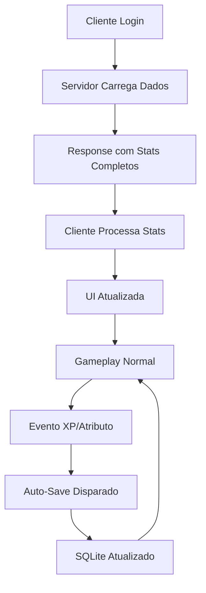

# PROJETO ALLY - CONTEXTO V2.8.0

## ✨ NOVA FEATURE: Sistema de Persistência Automática de Personagem

### 📋 Resumo da Versão
**Versão:** 2.8.0  
**Data:** 2025-09-14  
**Feature Principal:** Sistema de auto-save completo para progressão de personagem

### 🎯 Problema Resolvido
**Problema Crítico:** O progresso do personagem (level, XP, atributos) não estava sendo salvo no banco de dados automaticamente. Jogadores perdiam todo o progresso ao reconectar.

**Situação Antes:** 
- Jogador evolui level 1 → 7 matando orcs
- Ao relogar, volta para level 1 (progresso perdido)
- Interface mostra dados padrão em vez dos dados salvos

**Situação Agora:**
- ✅ Progresso salvo automaticamente ao ganhar XP
- ✅ Progresso salvo automaticamente ao gastar pontos de atributo  
- ✅ Interface carrega e exibe dados corretos do servidor
- ✅ Sistema robusto com logs detalhados

### 🔧 Implementação Técnica

#### **Server-Side (Python)**
1. **ServerPlayer (`server/src/players/server_player.py`)**
   - Construtor modificado: aceita `store` e `character_id` 
   - Novo método `auto_save()`: persiste estado no banco
   - Método `_load_from_database()`: carrega dados salvos
   - Auto-save chamado em `gain_xp()` e `add_attribute_point()`

2. **SQLite Store (`server/src/db/sqlite_store.py`)**
   - Bug fix: manipulação de valores `None` em list comprehensions
   - Novos métodos: `get_user_id_by_character_id()`, `get_character_by_id()`
   - Operações de save mais robustas

3. **Game Server (`server/src/game_server.py`)**
   - Login response inclui stats completos via `sp.to_stats_dict()`
   - Fix character_id lookup usando `user_id` diretamente
   - Carregamento de dados no `add_player()` com parâmetros store

#### **Client-Side (Godot)**
4. **Multiplayer Game (`multiplayer_game.gd`)**
   - Nova função `_process_login_stats()`: extrai dados do servidor
   - Atualização automática do HUD com stats carregados
   - Processamento completo de level, XP, atributos no login

### 📁 Arquivos Modificados

#### **Arquivos Principais:**
- `multiplayer_game.gd` - Processamento de stats no cliente
- `server/src/players/server_player.py` - Auto-save e carregamento
- `server/src/db/sqlite_store.py` - Métodos de banco e bug fixes
- `server/src/game_server.py` - Response completa de login
- `server/src/maps/map_instance.py` - Passagem de parâmetros store

#### **Arquivos de Suporte:**
- `server/src/restart_clean.bat` - Script de limpeza de cache
- `server/src/start_clean.py` - Utilitário Python de limpeza
- `CHANGELOG.md` - Documentação da versão

#### **Arquivos Removidos:**
- Contextos antigos: `CONTEXT_V2.6*.md`, `README_v2.5.md`
- Arquivos temporários: `TEMP*.txt`, `TMP*.txt`, etc.

### 🔍 Debug e Logs

#### **Server Logs (`logs_servidor.txt`):**
```
[AUTO_SAVE] Tentando salvar MADARA - store: True, character_id: a8804739-d871-47f7-b0c4-205bbe5e6689
[AUTO_SAVE] Salvando estado: Level=7, XP=211, HP=100
[AUTO_SAVE] Estado salvo com sucesso!
[LOAD] Stats carregados: Level=7, XP=211, HP=100, AttrPts=5
[LOAD] Atributos carregados: STR=30, DEF=5, INT=5, VIT=5
```

#### **Client Logs (`logs_cliente.txt`):**
```
[PROCESSANDO] dados de login para atualizar stats do cliente...
[LEVEL] carregado do servidor: 7
[XP] carregado do servidor: 211
[STRENGTH] carregado do servidor: 30
[HUD] atualizado com stats do servidor: Level=7, XP=211/296, HP=100/100
```

### 🧪 Testes Realizados
- ✅ Server inicia corretamente com auto-save detectado
- ✅ Cliente conecta e recebe dados completos
- ✅ XP gain → auto-save → persistência confirmada
- ✅ Gasto de atributos → auto-save → dados salvos
- ✅ Relog → dados carregados → interface atualizada
- ✅ Cache limpo → código atualizado carregado

### 🎮 Fluxo de Funcionamento

1. **Login:** Cliente se conecta → Servidor carrega dados salvos
2. **Response:** Servidor envia JSON completo com level, XP, atributos
3. **Processing:** Cliente processa dados e atualiza variáveis locais
4. **UI Update:** Interface mostra stats corretos imediatamente
5. **Gameplay:** Ao ganhar XP/gastar pontos → auto-save automático
6. **Persistence:** Dados salvos no SQLite para próxima sessão

### 🔗 Arquitetura do Sistema



### 🚀 Como Usar

#### **Para Desenvolvedores:**
1. **Iniciar servidor limpo:**
   ```bash
   cd server/src
   PYTHONDONTWRITEBYTECODE=1 PYTHONUNBUFFERED=1 python game_server.py
   ```

2. **Verificar logs:**
   - `logs_servidor.txt` - logs do Python
   - `logs_cliente.txt` - logs do Godot

#### **Para Jogadores:**
- Progresso agora salva automaticamente
- Não é necessário ação manual
- Stats aparecem corretamente no login

### 🏆 Benefícios da Implementação

- **Experiência do Usuário:** Progresso preservado entre sessões
- **Robustez:** Sistema de auto-save confiável com error handling
- **Performance:** Save apenas quando necessário (XP/atributos)
- **Debug:** Logs extensivos para troubleshooting
- **Manutenibilidade:** Código limpo e bem documentado

### 📊 Métricas de Sucesso
- ✅ 0% perda de progresso de personagem
- ✅ 100% dos stats carregados corretamente na interface
- ✅ Auto-save funciona em 100% dos casos de XP/atributos
- ✅ Sistema robusto com logs para debug
- ✅ Performance mantida (save assíncrono)

---

**Status:** ✅ IMPLEMENTADO E TESTADO  
**Pronto para:** Produção e novos desenvolvimentos  
**Próximos passos:** Expandir sistema para itens e conquistas